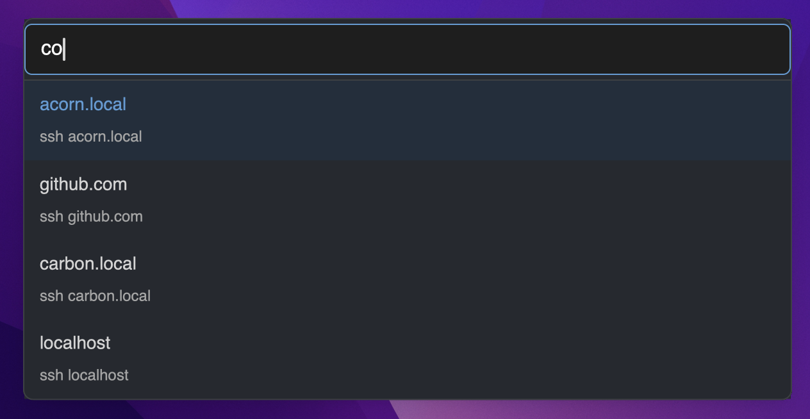

# Trident SSH Launcher

A native macOS menubar application for launching SSH connections with fuzzy search over your known hosts. Features automatic dark mode support and runs entirely from your menubar.



## Features

- **Native Menubar App**: Lives in your menubar for instant access
- **Automatic Dark Mode**: Icon adapts to system light/dark theme changes
- **Fuzzy Search**: Quickly find hosts by typing partial names
- **Terminal Integration**: Works with Ghostty, iTerm2, Alacritty, Kitty, WezTerm, Hyper, and Terminal.app
- **Auto-Discovery**: Automatically parses your SSH known_hosts and config files
- **Configuration-Driven**: Customize terminal preferences and file locations
- **Spotlight-Style UI**: Clean, macOS-native interface with keyboard navigation
- **Real-time Config Reload**: Press Cmd+R to reload configuration without restarting

## Installation

### Prerequisites

- macOS 12.0 or later
- Rust 1.70+ (for building from source)

### Build from Source

#### Option A: Using Nix (Recommended)
```bash
git clone https://github.com/iainh/trident.git
cd trident

# Build the macOS app bundle
nix build
./result/bin/trident-build

# Or run directly
nix run .
```

#### Option B: Using Cargo
```bash
git clone https://github.com/iainh/trident.git
cd trident

# Install cargo-bundle for creating app bundles
cargo install cargo-bundle

# Build the macOS app bundle
./build-app.sh
```

The app bundle will be created at `target/release/bundle/osx/Trident.app`.

### Installation Options

#### Option 1: Use the App Bundle (Recommended)
```bash
# Build the app bundle
./build-app.sh

# Install to Applications folder
cp -r target/release/bundle/osx/Trident.app /Applications/

# Launch from Applications or Spotlight
open /Applications/Trident.app
```

#### Option 2: Run from Command Line (Development)
```bash
# Run directly in development mode
cargo run

# Or build and run the binary directly
cargo build --release
./target/release/trident
```

The app will appear as a trident (ψ) icon in your menubar. Click it to access Trident options, or use the "Open Trident" menu item to launch the SSH connection interface.

## Global Hotkey Setup (Cmd+Shift+S)

Trident includes a global hotkey (Cmd+Shift+S) to quickly open the SSH launcher from anywhere on your system. To enable this feature, you need to grant accessibility permissions to Trident.

### Enabling Global Hotkey Access

1. **Launch Trident**: Start the app from Applications or by running it directly
2. **Permission Prompt**: The first time Trident tries to register the global hotkey, macOS will show a permission dialog
3. **System Preferences**: If the dialog doesn't appear, manually open:
   - **macOS Ventura/Sonoma**: System Settings → Privacy & Security → Accessibility
   - **macOS Monterey and earlier**: System Preferences → Security & Privacy → Privacy → Accessibility
4. **Add Trident**: Click the "+" button and add Trident.app to the list of allowed applications
5. **Restart Trident**: Quit and restart Trident for the permissions to take effect

### Verifying Global Hotkey

After granting permissions, you should see this message in the logs:
```
✅ Native global hotkey registered: Cmd+Shift+S (objc2-based)
```

If you see this instead, the hotkey registration failed:
```
❌ Failed to register native global hotkey
⚠️  No global hotkey available - use menubar only
```

### Troubleshooting Global Hotkey

**Global hotkey not working?**

1. **Check Accessibility Permissions**: Ensure Trident is listed and enabled in System Settings → Privacy & Security → Accessibility
2. **Conflicting Applications**: Another app might be using Cmd+Shift+S. Try temporarily quitting other apps
3. **Restart Required**: After changing accessibility permissions, restart Trident completely
4. **System Integrity Protection**: If you're on an older macOS version, ensure SIP allows accessibility features

**Still not working?**

The menubar interface is always available as a fallback. Click the trident (ψ) icon in your menubar and select "Open Trident" to access the SSH launcher interface.

## Configuration

Trident automatically creates a configuration file at `~/Library/Application Support/trident/config.toml` on first run, with your terminal auto-detected.

### Default Configuration

```toml
# Trident SSH Launcher Configuration
# Generated automatically with detected terminal: Ghostty

[terminal]
# Your detected terminal (you can change this):
program = "/Applications/Ghostty.app/Contents/MacOS/ghostty"
args = ["-e", "sh", "-c", "{ssh_command}"]

[ssh]
# SSH file locations (modify if you use custom locations)
known_hosts_path = "/Users/username/.ssh/known_hosts"
config_path = "/Users/username/.ssh/config"
ssh_binary = "/usr/bin/ssh"

[parsing]
# What to parse and how
parse_known_hosts = true
parse_ssh_config = true
# Simple parsing only looks at Host entries, ignores Include directives
simple_config_parsing = true
# Skip hashed entries in known_hosts (recommended)
skip_hashed_hosts = true

[ui]
# User interface settings
max_results = 20
case_sensitive = false
```

### Terminal Configuration

Trident automatically detects your installed terminal, but you can configure any terminal:

#### Ghostty
```toml
[terminal]
program = "/Applications/Ghostty.app/Contents/MacOS/ghostty"
args = ["-e", "sh", "-c", "{ssh_command}"]
```

#### iTerm2
```toml
[terminal]
program = "/Applications/iTerm.app/Contents/MacOS/iTerm2"
args = ["-c", "tell application \"iTerm2\" to create window with default profile command \"{ssh_command}\""]
```

#### Alacritty
```toml
[terminal]
program = "/Applications/Alacritty.app/Contents/MacOS/alacritty"
args = ["-e", "sh", "-c", "{ssh_command}"]
```

#### Terminal.app
```toml
[terminal]
program = "/usr/bin/osascript"
args = ["-e", "tell app \"Terminal\" to do script \"{ssh_command}\""]
```

### SSH File Configuration

Point Trident to your SSH files:

```toml
[ssh]
known_hosts_path = "/Users/username/.ssh/known_hosts"
config_path = "/Users/username/.ssh/config"
ssh_binary = "/usr/bin/ssh"

[parsing]
parse_known_hosts = true    # Parse ~/.ssh/known_hosts
parse_ssh_config = true     # Parse ~/.ssh/config
simple_config_parsing = true  # Only parse Host entries, ignore Include
skip_hashed_hosts = true    # Skip hashed entries in known_hosts
```

## Usage

### Menubar App Mode (Recommended)

1. **Install**: Copy `Trident.app` to your Applications folder
2. **Launch**: Open Trident from Applications or Spotlight
3. **Access**: Click the trident (ψ) icon in your menubar
4. **Open Interface**: Select "Open Trident" from the menu to launch the SSH interface
5. **Search**: Type to filter your SSH hosts with fuzzy matching
6. **Navigate**: Use arrow keys to select a host
7. **Connect**: Press Enter or click to launch the SSH connection
8. **Close**: Press Escape to close without connecting

The app runs in the background and only appears in your menubar - no dock icon clutter!

### Command Line Mode (Development)

1. **Launch**: Run `cargo run` or `./target/release/trident`
2. **Search**: Type to filter your SSH hosts with fuzzy matching
3. **Navigate**: Use arrow keys to select a host
4. **Connect**: Press Enter or click to launch the SSH connection
5. **Close**: Press Escape to close without connecting

### Keyboard Shortcuts

- **Arrow Keys**: Navigate host list
- **Enter**: Connect to selected host
- **Tab**: Accept autocomplete suggestion
- **Escape**: Close launcher
- **Cmd+R**: Reload configuration

## Troubleshooting

### Debug Mode

Enable debug logging to troubleshoot issues:

```bash
TRIDENT_DEBUG=1 trident
```

This will show detailed information about:
- Configuration loading and validation
- SSH file parsing
- Terminal launching
- Host detection

### Common Issues

**No hosts found**: Check that your SSH files exist and contain valid entries:
```bash
ls -la ~/.ssh/known_hosts ~/.ssh/config
```

**Terminal won't launch**: Verify your terminal configuration:
```bash
# Test if your terminal program exists
ls -la "/Applications/YourTerminal.app/Contents/MacOS/terminal-binary"
```

**Configuration errors**: Trident will show specific error messages with suggestions for fixing common configuration issues.

## Architecture

Trident follows a configuration-driven approach:

- **No auto-detection complexity**: Users specify exactly how they want terminals launched
- **Simple SSH parsing**: Focuses on extracting hostnames for search, not complex SSH features
- **User control**: All behavior is configurable through the config file
- **Performance focused**: < 50ms search response time, < 500ms startup time

## Development

### Development Environment

#### Using Nix (Recommended)
```bash
# Enter development environment with all dependencies
nix develop

# Run all quality assurance checks
nix flake check

# Run individual checks
nix run .#test         # Run tests
nix run .#clippy       # Run linter (warnings as errors)
nix run .#fmt-check    # Check code formatting
nix run .#audit        # Security vulnerability audit
nix run .#deny         # License and dependency checking
nix run .#build-check  # Verify project builds
```

#### Using Cargo
```bash
# Run tests
cargo test

# Run linter
cargo clippy

# Format code
cargo fmt

# Security audit
cargo audit

# Build project
cargo build
```

### Quality Assurance

The project includes comprehensive QA checks that run automatically in CI:
- **Unit Tests**: 42+ tests covering core functionality
- **Linting**: Clippy with warnings treated as errors
- **Formatting**: Code must be properly formatted with rustfmt
- **Security**: Vulnerability scanning with cargo-audit
- **Build**: Project must compile on all supported platforms

Run all checks locally with: `nix flake check`

## Contributing

1. Fork the repository
2. Create a feature branch (`git checkout -b feature/amazing-feature`)
3. Run quality checks (`nix flake check`) and ensure they pass
4. Commit your changes (`git commit -m 'Add amazing feature'`)
5. Push to the branch (`git push origin feature/amazing-feature`)
6. Open a Pull Request

## License

This project is licensed under the MIT License - see the [LICENSE](LICENSE) file for details.

## Acknowledgments

- Built with [GPUI](https://github.com/zed-industries/gpui) - Zed's GPU-accelerated UI framework
- Inspired by macOS Spotlight and Zed's command palette
- Terminal integration patterns inspired by various macOS terminal launchers
